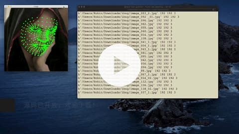
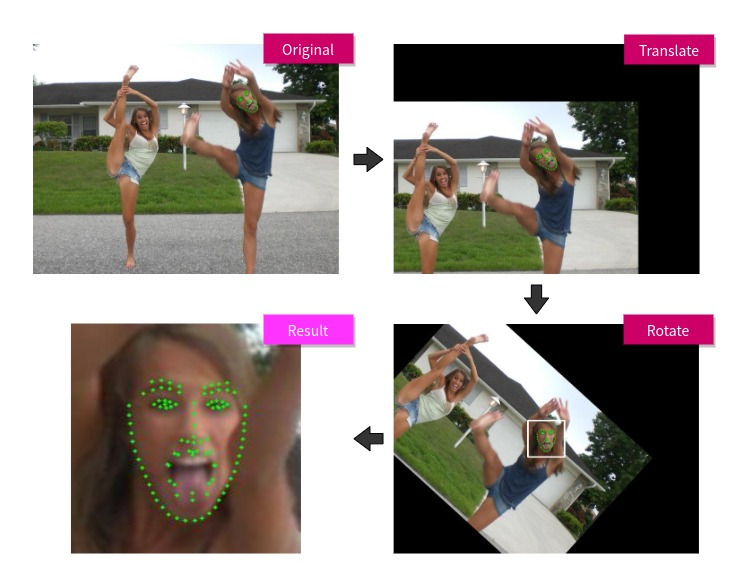

# face-mesh-generator
Generate face mesh dataset using Google's FaceMesh model from annotated face datasets.

Watch this 30s video demo:

[](https://www.bilibili.com/video/BV1Jp4y1v7MY/).

## Features
There are built in features to help generating the dataset more efficiently.

- Automatically centralize the marked face.
- Rotate the image to align the face horizontally.
- Crop the face with custom scale range.
- Generate mark heatmaps.
- Write TensorFlow Record files, or export the processed image and marks.
- Support multiple public datasets. Check the full list [here](https://github.com/yinguobing/facial-landmark-dataset
)



## Getting Started

These instructions will get you a copy of the project up and running on your local machine for development and testing purposes.

### Prerequisites


### Installing
First clone this repo.

```bash
# From your favorite development directory
git clone https://github.com/yinguobing/face-mesh-generator.git
```

Then download Google's FaceMesh tflite model and put it in the `assets` directory.

Model link: https://github.com/google/mediapipe/blob/master/mediapipe/models/face_landmark.tflite

## How to run
Take WFLW as an example. Download the dataset files from the official website. Extract all files to one directory.

First, Construct the dataset.
```python
ds_wflw = fmd.wflw.WFLW("wflw")
ds_wflw.populate_dataset(wflw_dir)
```
`wflw_dir` is the directory for the extracted files.

Then, process the dataset.
```python
process(ds_wflw)
```

There is a demo file `generate_mesh_dataset.py` demonstrating how to generate face mesh data and save them in a TFRecord file. Please refer to it for more details.

## Authors
Yin Guobing (尹国冰) - yinguobing


## License


## Acknowledgments
All the authors who made their datasets and model public.
